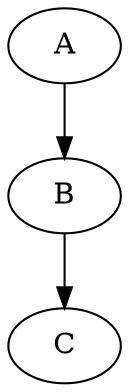
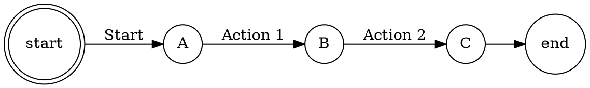
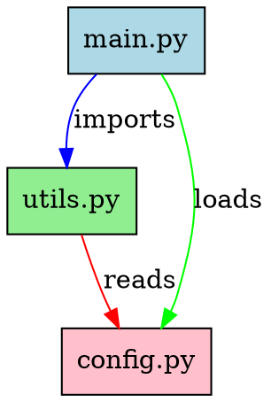
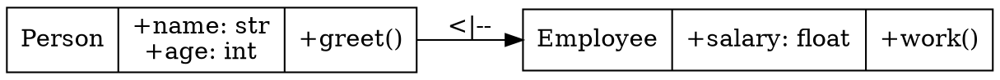
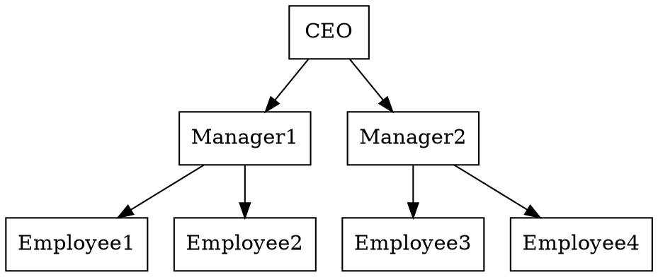

<!-- last-verified: 2026-08-20 -->
# 🎨 Visualisierungs-Leitfaden für den Chatbot

> **🔒 DATENSCHUTZ-HINWEIS: Alle Visualisierungen laufen 100% lokal!**
> Keine Daten werden an Dritte übertragen (DSGVO-konform).

---

## 📊 Übersicht: Unterstützte Visualisierungstypen

| **Typ** | **Tool** | **Beschreibung** | **Format** | **Datenschutz** |
|---------|----------|-----------------|------------|-----------------|
| **Mermaid** | `utils/mermaid_diagram.py` | Flussdiagramme, Mindmaps, Klassendiagramme, etc. | SVG/PNG (Browser) | ✅ 100% lokal (CDN, aber im Browser isoliert) |
| **GenericVisualization** | `generic_visualization_tool.py` | Netzwerke, Zeitachsen, Hierarchien, etc. | PNG/SVG | ✅ 100% lokal |
| **Graphviz** | `generic_visualization_tool.py` | **Dependency Graphs, State Machines, UML** | PNG/SVG/PDF | ✅ **100% lokal (keine Internetverbindung!)** |
| **ChatImageGenerator** | `chat_image_generator.py` | Balkendiagramme, Konzept-Diagramme | PNG | ✅ 100% lokal |

---

## 🎯 Graphviz: Professionelle Diagramme (NEU!)

**Graphviz ist jetzt vollständig integriert und 100% lokal/Datenschutz-konform!**

### 📌 Was ist Graphviz?
Graphviz (Graph Visualization Software) ist ein **Industrie-Standard-Tool** für die Erstellung von:
- **Dependency Graphs** (Abhängigkeitsdiagramme)
- **State Machines** (Zustandsautomaten)
- **UML-Diagramme** (Klassen-, Use-Case-Diagramme)
- **Organigramme** (Hierarchien)
- **Netzwerk-Topologien**
- **Flowcharts** (komplexe Flussdiagramme)

### 🔧 Installation
```bash
pip install graphviz
```
*Das Python-Paket installiert automatisch die benötigten System-Binaries.*

### 💡 Verwendung

#### **Methode 1: JSON mit nodes/edges** (empfohlen für Nutzer)
```json
{
  "type": "graphviz",
  "title": "Modul-Abhängigkeiten",
  "graph_type": "digraph",  // oder "graph" für ungerichtet
  "format": "png",         // png, svg, pdf, jpg
  "nodes": [
    {"id": "main", "label": "Hauptmodul"},
    {"id": "utils", "label": "Hilfsfunktionen"},
    {"id": "config", "label": "Konfiguration"}
  ],
  "edges": [
    {"source": "main", "target": "utils", "label": "importiert"},
    {"source": "main", "target": "config", "label": "lädt"},
    {"source": "utils", "target": "config", "label": "benötigt"}
  ]
}
```

#### **Methode 2: Direkter DOT-Code** (für Experten)
```json
{
  "type": "graphviz",
  "dot_code": """
  digraph DependencyGraph {
    rankdir=LR;
    node [shape=box, style=filled, fillcolor=lightblue];
    "main.py" -> "utils.py" [label="imports"];
    "main.py" -> "config.py" [label="loads"];
    "utils.py" -> "config.py" [label="reads"];
  }
  """,
  "format": "svg"
}
```

### 🎨 DOT-Code Beispiele

#### **1. Einfacher gerichteter Graph**


#### **2. State Machine**


#### **3. Dependency Graph mit Styling**


#### **4. UML-Klassendiagramm**


#### **5. Organigramm**


---

## 📋 GenericVisualizationTool: Alle Diagramm-Typen

### 🎯 Unterstützte Typen (11+)

| **Typ** | **Beschreibung** | **JSON-Beispiel** |
|---------|-----------------|------------------|
| `network` | Netzwerk-Diagramme (Graphs) | `nodes`, `edges` |
| `timeline` | Zeitachsen | `events` |
| `hierarchy` | Hierarchien (Bäume) | `nodes`, `edges` |
| `flowchart` | Flussdiagramme | `steps` |
| `mindmap` | Mind Maps | `central`, `branches` |
| `gantt` | Gantt-Charts | `tasks`, `dependencies` |
| `comparison` | Vergleichsdiagramme | `categories`, `series` |
| `scatter` | Streudiagramme | `series` mit x/y |
| `heatmap` | Heatmaps | `values`, `x_labels`, `y_labels` |
| `pie` | Kreisdiagramme | `slices` |
| `sankey` | Sankey-Diagramme | `flows`, `nodes` |
| `graphviz` | **Graphviz-Diagramme** | `nodes`/`edges` oder `dot_code` |

### 💡 Beispiele

#### **Netzwerk-Diagramm**
```json
{
  "type": "network",
  "title": "Social Network",
  "nodes": [
    {"id": "alice", "label": "Alice", "color": "#FF6B6B"},
    {"id": "bob", "label": "Bob", "color": "#4ECDC4"}
  ],
  "edges": [
    {"source": "alice", "target": "bob", "label": "friends"}
  ]
}
```

#### **Zeitachse**
```json
{
  "type": "timeline",
  "title": "Projekt-Meilensteine",
  "events": [
    {"year": 2024, "label": "Projektstart", "phase": "Initiierung"},
    {"year": 2024, "label": "Phase 1 abgeschlossen", "phase": "Entwicklung"},
    {"year": 2025, "label": "Release", "phase": "Abschluss"}
  ]
}
```

#### **Hierarchie**
```json
{
  "type": "hierarchy",
  "title": "Organisationsstruktur",
  "nodes": [
    {"id": "root", "label": "CEO"},
    {"id": "child1", "label": "Manager A"},
    {"id": "child2", "label": "Manager B"}
  ],
  "edges": [
    {"source": "root", "target": "child1"},
    {"source": "root", "target": "child2"}
  ]
}
```

---

## 🎨 Mermaid-Diagramme

### 📌 Unterstützte Typen (8+)
- `flowchart` (Flussdiagramm)
- `mindmap` (Mind Map)
- `gantt` (Gantt-Chart)
- `classDiagram` (Klassendiagramm)
- `sequenceDiagram` (Sequenzdiagramm)
- `stateDiagram` (Zustandsdiagramm)
- `erDiagram` (Entity-Relationship)
- `pie` (Kreisdiagramm)

### 💡 Verwendung
In der Streamlit-Sidebar: **"📊 Mermaid Studio"** öffnen und Diagramm erstellen.

### 🔒 Datenschutz
- Mermaid.js wird von CDN (jsdelivr.net) geladen
- **Aber:** Der Code läuft **isoliert im Browser** – keine Datenübertragung!
- Security-Level: `strict` (kein JavaScript, keine XSS)

---

## 📊 ChatImageGenerator: Automatische Diagramme

Erkennt automatisch, wenn ein Nutzer nach Visualisierungen fragt und generiert:
- **Balkendiagramme** (aus Tabellen/Daten)
- **Konzept-Diagramme** (aus Beschreibungen)

### 💡 Trigger-Wörter
- **Balkendiagramme:** "vergleich", "statistik", "zahlen", "daten", "verteilung", "anteil", "prozent"
- **Konzept-Diagramme:** "struktur", "aufbau", "schema", "konzept", "modell", "architektur", "workflow", "prozess"

---

## 🌐 Internet-Bilder

Lädt Bilder von:
- **Wikimedia Commons** (lizenzfreie Bilder)
- **Unsplash** (hochwertige Stock-Fotos)

### ⚠️ Datenschutz-Hinweis
- Bilder werden **nur bei expliziter Anfrage** geladen
- **Relevanz-Score:** Nur Bilder über 60% Relevanz werden angezeigt
- **Unzensiert:** Alle relevanten Bilder werden gezeigt (auch explizite Inhalte)

---

## 🎯 Empfehlungen: Welches Tool für welchen Zweck?

| **Zweck** | **Empfohlenes Tool** | **Begründung** |
|-----------|---------------------|----------------|
| **Abhängigkeiten visualisieren** | Graphviz | Industrie-Standard, professionell |
| **State Machines** | Graphviz | Standard für Zustandsautomaten |
| **UML-Diagramme** | Graphviz oder Mermaid | Graphviz für komplexe, Mermaid für einfache |
| **Flussdiagramme** | Mermaid oder GenericVisualization | Mermaid für Text, Generic für Daten |
| **Mind Maps** | Mermaid oder GenericVisualization | Beide gut |
| **Netzwerke** | GenericVisualization (NetworkX) | Gut für Graphen |
| **Zeitachsen** | GenericVisualization | Flexibel und schön |
| **Balkendiagramme** | ChatImageGenerator oder GenericVisualization | Automatisch oder manuell |
| **3D-Plots** | (Noch nicht verfügbar) | Plotly-Integration geplant |

---

## 🚀 Schnellstart: Visualisierungen erstellen

### **1. Mermaid (einfachste Methode)**
```
"Erstelle ein Flussdiagramm für den Login-Prozess"
```
→ **Automatisch:** Mermaid Studio öffnet sich in der Sidebar

### **2. Graphviz (professionell)**
```
"Erstelle ein Dependency-Diagramm für Modul A, Modul B und Modul C"
```
→ **Automatisch:** Der Bot erstellt ein Graphviz-Diagramm

### **3. GenericVisualization (flexibel)**
```
"Zeige ein Netzwerk-Diagramm mit den Knoten Alice, Bob und Charlie"
```
→ **Automatisch:** Der Bot erstellt ein Netzwerk-Diagramm

---

## 🔧 Troubleshooting

### **Graphviz funktioniert nicht?**
1. **Installation prüfen:**
   ```bash
   pip install graphviz
   ```
2. **System-Tool prüfen:**
   ```bash
   dot -V
   ```
   Falls nicht verfügbar: [Graphviz herunterladen](https://graphviz.org/download/)

### **Mermaid funktioniert nicht?**
- Prüfe die Internetverbindung (CDN wird benötigt)
- Browser-Cache leeren

### **GenericVisualization funktioniert nicht?**
- Prüfe, ob matplotlib installiert ist:
  ```bash
  pip install matplotlib
  ```

---

## 📚 Weitere Ressourcen

- [Graphviz Dokumentation](https://graphviz.org/doc/info/lang.html)
- [Mermaid Dokumentation](https://mermaid.js.org/)
- [Matplotlib Dokumentation](https://matplotlib.org/)
- [NetworkX Dokumentation](https://networkx.org/)

---

## 🎉 Zusammenfassung

✅ **Graphviz ist jetzt verfügbar** – 100% lokal, DSGVO-konform  
✅ **19+ Diagramm-Typen** unterstützen fast alle Use-Cases  
✅ **Automatische Erkennung** von Visualisierungsanfragen  
✅ **Professionelle Qualität** für technische Diagramme  

**→ Dein Bot ist jetzt SOTA für Visualisierungen!** 🚀
